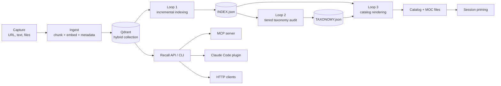

# kb-core

Self-hosted knowledge base that gives your coding agents long-term memory.

kb-core is a local-first Qdrant-backed memory layer for coding workflows. It ingests notes, documents, and captured context into a hybrid dense/sparse index, keeps an evolving catalog of what it knows, and exposes raw retrieval results to stronger coding agents at the moment they need context.

## Why This Is Not Another AnythingLLM

kb-core is agent-first rather than chat-first. It is designed to prime coding sessions, serve MCP tools, and let external agents pull exact source snippets into their own reasoning loop.

The taxonomy is self-evolving. New material is classified on ingest, low-risk tag cleanup can be applied automatically, and higher-risk category changes stay reviewable.

Session priming is a first-class workflow. A project-aware hook can show relevant knowledge at the start of an agent session, before the user remembers to ask.

Retrieval is intentionally retrieval-only. kb-core returns source chunks and metadata to the working agent instead of asking a weaker local model to digest the evidence first.

## Architecture



## Two ways to run it

**Desktop app** — one download, no Docker, no Python. The vector store runs
in-process and the UI opens in your browser. Packaged for end users as
**[Almanac](https://mybuilt.app/almanac/)**; kb-core is the engine inside it.

- [macOS (Apple silicon)](https://github.com/Erichan12818/kb-core/releases/latest/download/kb-core-macos-arm64.zip)
- [Linux (x86-64)](https://github.com/Erichan12818/kb-core/releases/latest/download/kb-core-linux-x64.tar.gz)

The macOS build is not yet signed with a Developer ID, so Gatekeeper blocks the
first launch. Approve it under System Settings > Privacy & Security > Open
Anyway, or clear the quarantine attribute:

```bash
xattr -d com.apple.quarantine /Applications/kb-core.app
```

Control-clicking the app and choosing Open does *not* work on macOS 15 or
later — Apple removed that bypass. To build a bundle yourself instead, see
[packaging/README.md](./packaging/README.md).

**Docker Compose** — for a NAS or a machine that stays on, where the API and
the worker run as separate services against a shared Qdrant.

## Quickstart

Start with [QUICKSTART.md](./QUICKSTART.md). With Compose the shortest path is:

```bash
cp config/kb_config.example.yaml config/kb_config.yaml
docker compose up -d
curl -s http://127.0.0.1:8377/health
```

The example config uses a local `./vault`, the Compose `qdrant` service, and an optional local Ollama profile. Configure any cloud classifier through environment variables, not checked-in secrets.

## Agent Integration

There are two intended integration paths:

- MCP server: expose recall, add, and health tools to agents that support Model Context Protocol.
- Claude Code plugin: package session-start priming, a recall skill, and MCP registration for Claude Code.

Both paths should point at the same kb-core deployment. The HTTP API remains useful for lightweight automation and smoke tests.

The Claude Code plugin ships inside this monorepo at
[`plugins/claude-code`](./plugins/claude-code). After kb-core is configured, set `KB_HOME` to
this repository and add that directory as a local Claude Code marketplace.

## Taxonomy Policy

Create `taxonomy_policy.md` in your KB root when you want to steer the self-evolving catalog. Keep it short and operational:

- Preferred category names and when to use them.
- Tags that should be merged, avoided, or reserved.
- Sensitive topics that must stay on local models.
- Review rules for stale notes or high-similarity files.

Example:

```markdown
# Taxonomy Policy

## Preferred Categories
- engineering: implementation notes, debugging records, architecture decisions
- research: external references, comparisons, market notes

## Forbidden Tags
- misc
- todo

## Sensitive Routing
- Personal, financial, client, or credential-related files must use local-only classification.
```

See [docs/TAXONOMY_POLICY.md](./docs/TAXONOMY_POLICY.md) for a fuller template and guidance.

## Documentation

- [Configuration](./docs/CONFIG.md)
- [Architecture](./docs/ARCHITECTURE.md)
- [Taxonomy policy](./docs/TAXONOMY_POLICY.md)
- [Contributing](./docs/CONTRIBUTING.md)
- [Security scan](./SECURITY_SCAN.md)
